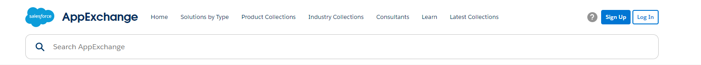
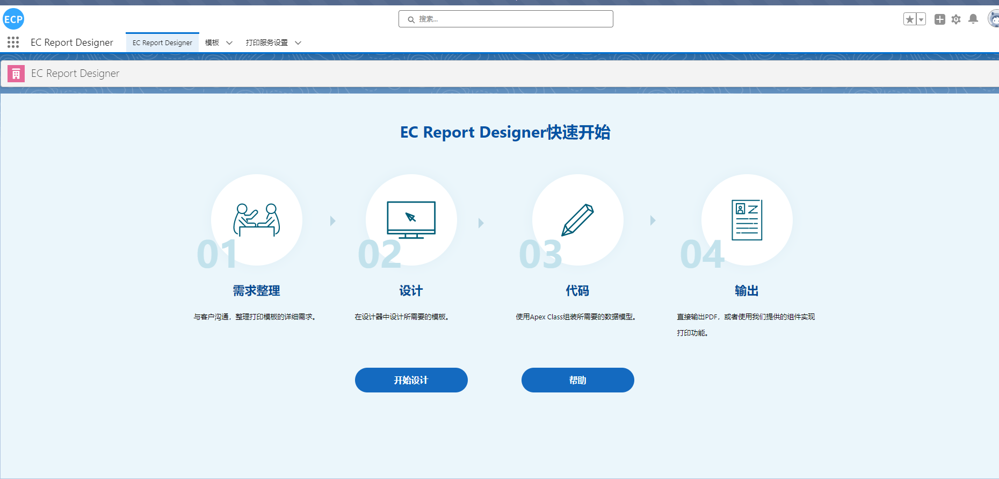

# 快速使用

### 1. Salesforce AppExchange 中查找我们的应用并安装到环境中

 

### 2. 按照提示开始使用

 * 模板：存放基本的模板数据
 * 打印服务设置：存放打印相关设定
 * EC Designerカスタム設定：存放模板中心Url
 * Permission Set：ECDesigner管理者

 

### 3. 打印服务客户端安装，下载后安装提示安装即可（如果需要使用）

