# 开始设计
*（以模版中心的请求书为例）*

### 1. 通过Home Tab的快速开始或新建テンプレート数据的方式开始设计
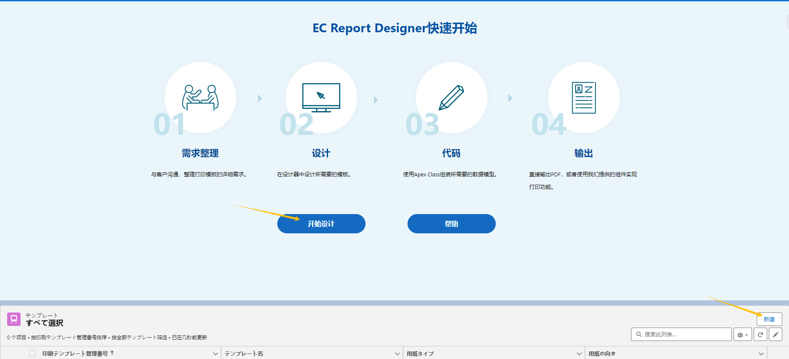

### 2. 打开设计器
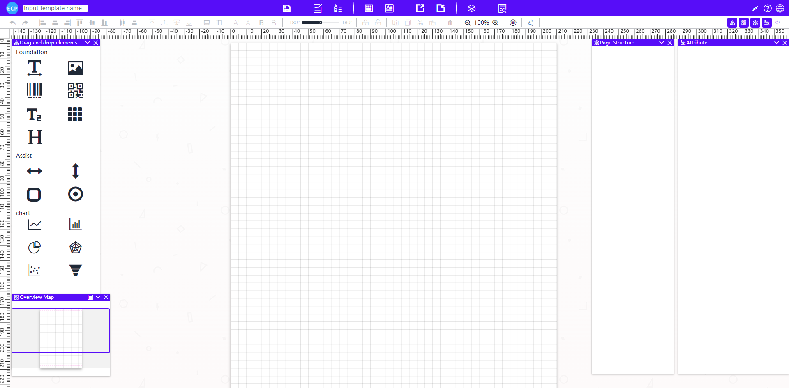

### 3. 设计器右上角可切换语言
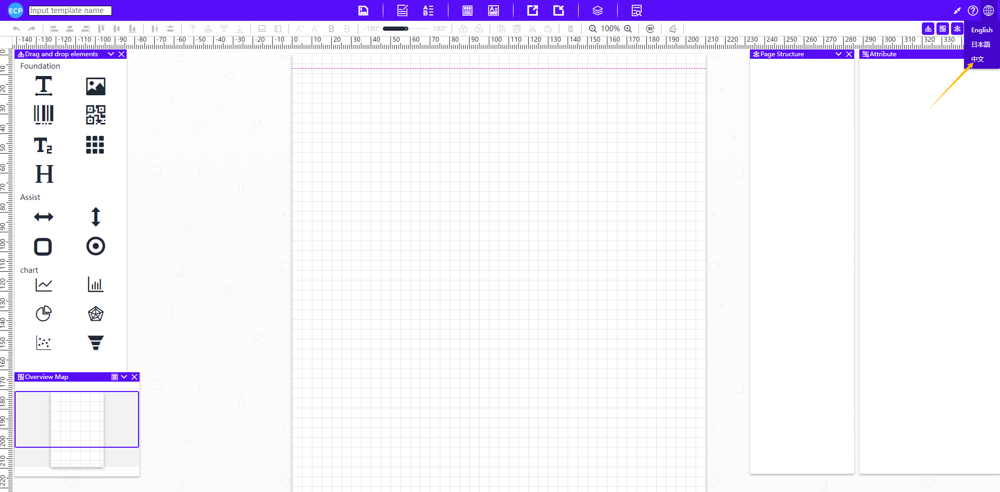
### 切换后

### 4. 在模板中心选择模版
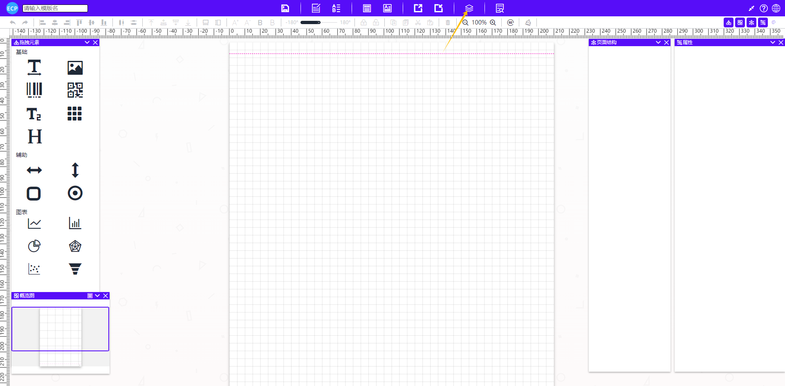
### 5.选择请求书模板并确认
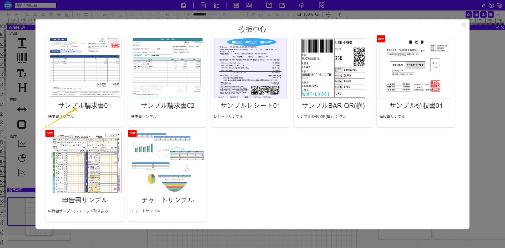
### 6.相应的模版会反映到画面上
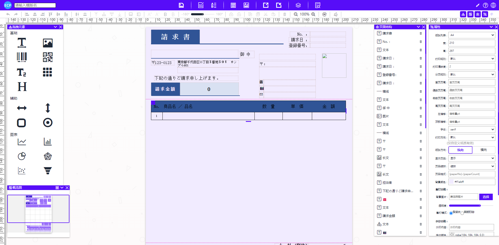
### 7.可以参照本手册，对模板进行进一步修改
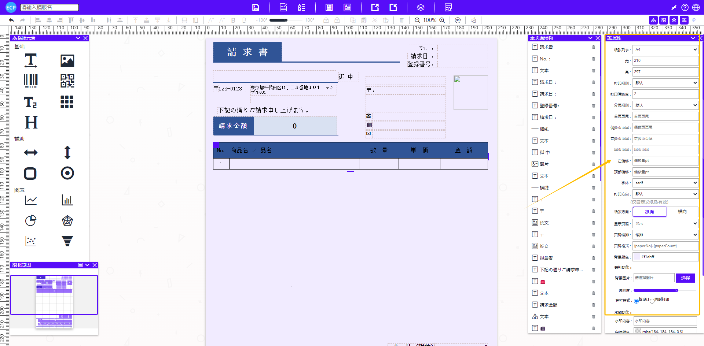
### 8.点击预览
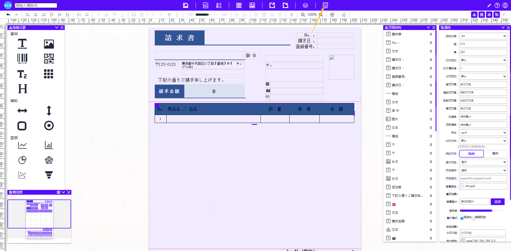
### 9.模板中心取出的模板会自带部分测试数据，可以在预览画面选择导出PDF 或浏览器打印
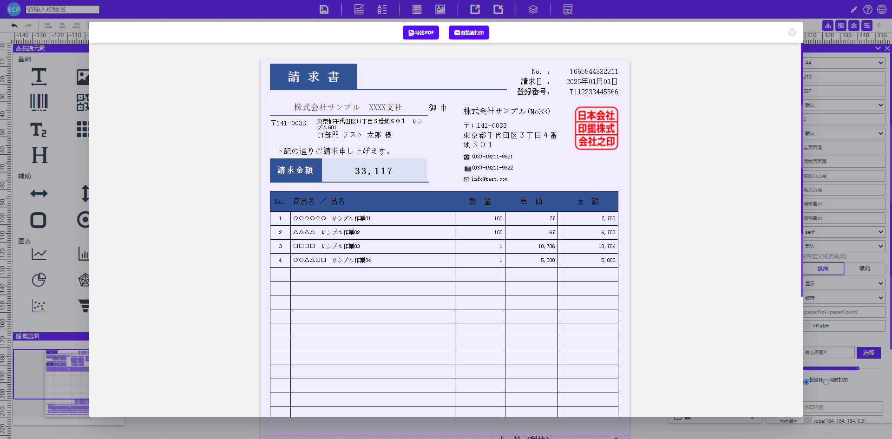
### 10.填入模版名

### 11.点击保存Icon， 或Ctrl+S保存模板
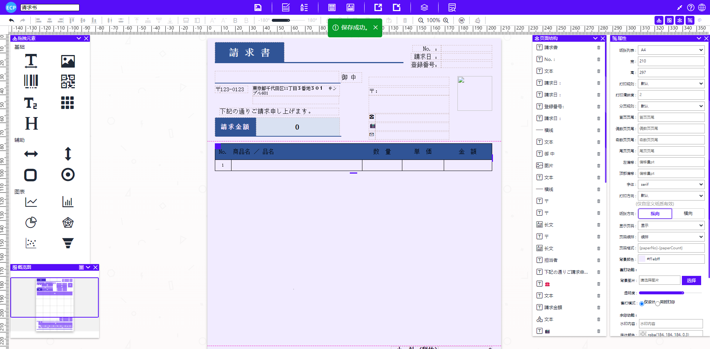
### 12.点击模板Tab来查看创建好的模板
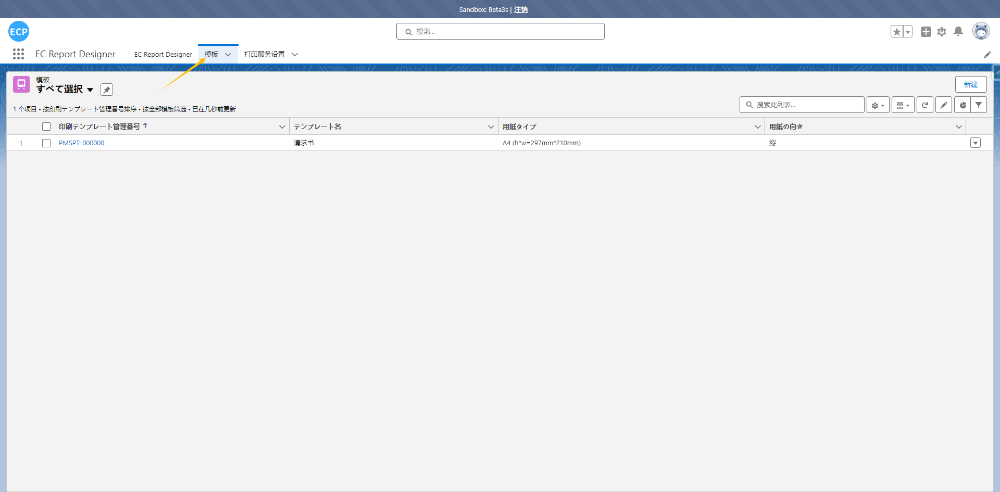
### 13.点击编辑能再次在设计器中编辑该模板
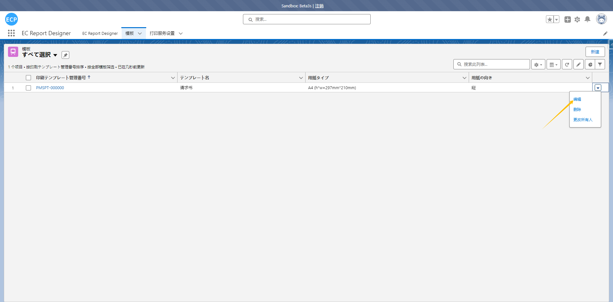
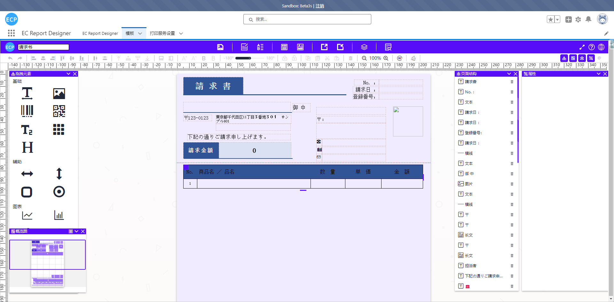